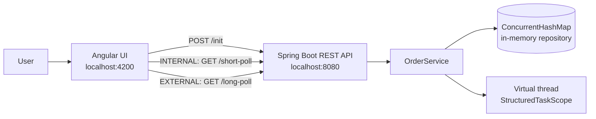
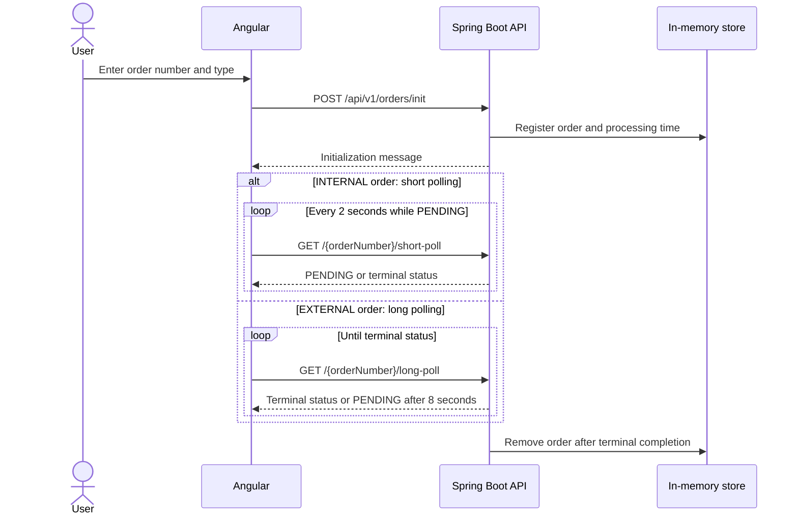

# Order Polling Demo

This project is a small teaching example of two HTTP polling strategies for an order-processing workflow:

- **Short polling:** the client sends a new request every two seconds and receives the order's current status immediately.
- **Long polling:** the server holds the request open for up to eight seconds, returning as soon as processing finishes or `PENDING` when the wait window expires.

The order processing itself is simulated. Orders are stored in memory, receive a random processing time between 5 and 20 seconds, and finish with a simulated terminal result.

## What This Demo Shows

- How a browser can track work that does not finish during the initial request.
- The difference between repeated short requests and a server-held long-poll request.
- Spring MVC REST endpoints called by an Angular application.
- Java virtual threads and `StructuredTaskScope` for the long-polling wait.
- Client-side RxJS subscription cleanup and repeated polling.

## Architecture



### Frontend

The Angular application is in [`frontend/`](frontend/). `OrderPollingComponent`:

1. Validates the order number and initializes the order.
2. Selects the polling strategy from the order type.
3. Uses an RxJS `interval(2000)` for short polling.
4. Uses `expand()` to issue another long-poll request only when the previous response is still `PENDING`.
5. Stops the active subscription when a terminal result or an error is received.

`OrderService` contains the HTTP client calls and uses the API base URL `http://localhost:8080/api/v1/orders`.

### Backend

The Spring Boot application is in [`orderPollingApi/`](orderPollingApi/).

- `OrderController` exposes the REST API.
- `OrderService` owns the simulated processing and polling behavior.
- `OrderContext` stores the order type, creation time, and assigned processing duration.
- `ConcurrentHashMap` acts as the in-memory repository.
- `WebConfig` allows requests from the Angular development server at `http://localhost:4200`.

The backend requires **Java 25** and enables preview features because the long-polling implementation uses `StructuredTaskScope`.

## Request Flow



## API Reference

Base URL: `http://localhost:8080/api/v1/orders`

| Method | Endpoint | Description |
| --- | --- | --- |
| `POST` | `/init?orderNumber={number}&type={INTERNAL\|EXTERNAL}` | Creates an order and assigns a random processing duration. |
| `GET` | `/{orderNumber}/short-poll` | Returns immediately with `PENDING` or a terminal status. |
| `GET` | `/{orderNumber}/long-poll` | Waits up to 8 seconds for an external order to finish. |

Possible backend statuses are `PENDING`, `COMPLETED`, `REJECTED`, and `CANCELLED`. This demo generates `PENDING`, `COMPLETED`, or `REJECTED` during normal processing.

An order is removed from the in-memory store after a terminal result. Reusing the same order number therefore fails during initialization, while polling an unknown or already-removed order returns an order-not-found error.

## Running Locally

### Prerequisites

- Java 25
- Node.js and npm compatible with Angular 16
- A terminal in the project root

### 1. Start the backend

```bash
cd orderPollingApi
./mvnw spring-boot:run -Dspring-boot.run.jvmArguments="--enable-preview"
```

The API starts on `http://localhost:8080`. The `--enable-preview` flag is required because the long-polling implementation uses `StructuredTaskScope`.

Run backend tests with:

```bash
./mvnw test
```

On Windows, use `mvnw.cmd` instead of `./mvnw`.

### 2. Start the frontend

In a second terminal:

```bash
cd frontend
npm install
npm start
```

Open `http://localhost:4200` in a browser. Choose `INTERNAL (Short Polling)` or `EXTERNAL (Long Polling)`, enter an order number, and select **Submit & Poll**.

### 3. Try the API directly

```bash
curl -X POST "http://localhost:8080/api/v1/orders/init?orderNumber=20&type=INTERNAL"
curl "http://localhost:8080/api/v1/orders/20/short-poll"
```

For long polling, initialize an external order and call:

```bash
curl -X POST "http://localhost:8080/api/v1/orders/init?orderNumber=21&type=EXTERNAL"
curl "http://localhost:8080/api/v1/orders/21/long-poll"
```

The long-poll request may take up to eight seconds before returning `PENDING`. The client then starts another request.

## Short Polling vs. Long Polling

| Concern | Short polling | Long polling |
| --- | --- | --- |
| Request behavior | Returns immediately | Waits for a result or timeout |
| Client request rate | Fixed: every 2 seconds | Usually one outstanding request |
| Empty responses | Can produce many `PENDING` responses | Reduces unnecessary responses |
| Server resources | More request overhead | Holds a request while waiting |
| Demo order type | `INTERNAL` | `EXTERNAL` |

Long polling is not a push protocol: the client still sends another request after a timeout or response. WebSockets or server-sent events are alternatives when a true server-to-client stream is more appropriate.

## Project Structure

```text
polling/
├── frontend/                 # Angular application
│   └── src/app/
│       ├── order-polling.component.*
│       └── services/order.service.ts
├── orderPollingApi/          # Spring Boot application
│   └── src/
│       ├── main/java/...      # Controller, service, and domain classes
│       └── test/java/...      # Backend tests
└── README.md
```

## Notes and Limitations

- The repository is in memory; restarting the backend removes all orders.
- Processing durations and outcomes are random, so exact results are not deterministic.
- This is a learning demo, not a production order-processing system. Production systems normally persist orders and use durable asynchronous jobs or messaging.
- The backend enum uses `COMPLETED` as the successful terminal status. Keep the Angular status type and terminal-state handling aligned with that API contract when extending the UI.

## Screenshots

The attached screenshots show the two important UI states: an order in `PENDING` while polling is active, and a completed order after processing finishes. Keep screenshots beside this README and add relative Markdown image links if they are committed to the repository.
