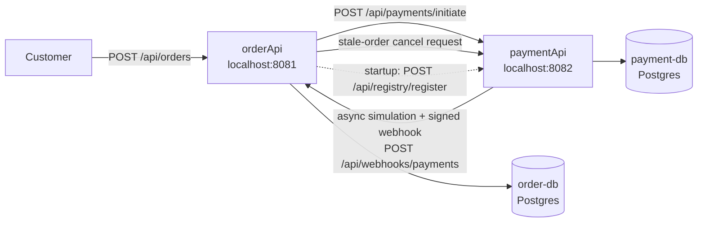

# Payment Processing Webhook Demo

This project models the classic e-commerce payment webhook flow across two
independently deployable Spring Boot services:

- **[`orderApi/`](orderApi/)** — the online store backend. Customers submit
  orders through its public API; it starts a payment with the payment
  application and later receives a signed webhook reporting the outcome.
- **[`paymentApi/`](paymentApi/)** — a stand-in payment provider (like
  Stripe/PayPal). It lets merchants register a webhook URL and secret,
  simulates payment processing in the background, and delivers a signed,
  retried webhook once a payment settles.

The store never blocks waiting for a payment to complete: it gets an
immediate `PAYMENT_PROCESSING` response, and the payment application notifies
it later, asynchronously, via webhook.

## What This Demo Shows

- Webhook **registration**: a merchant registers its callback URL and secret
  before it can receive events.
- **HMAC-SHA256 signed delivery**: the payment application signs every
  webhook body; the store verifies the signature in a servlet filter before
  any business logic runs.
- **Retries with backoff**: the payment application retries failed webhook
  deliveries with an exponential backoff (Spring Retry).
- **Idempotency at two layers**: the store guards against processing the same
  webhook delivery twice, both with a service-layer existence check and a
  database-layer unique constraint.
- A simulated, asynchronous payment provider with a random processing delay
  and a random success/failure outcome.
- A five-minute orderApi sweep that requests cancellation for payments still
  processing ten minutes after the order's last update.

## Architecture



### orderApi (online store)

- `OrderController` — public `POST /api/orders` endpoint.
- `OrderService` — validates stock, computes the total, persists the order,
  and calls `PaymentClient` to start payment.
- `RegistrationRunner` — on every startup, registers this store's webhook URL
  and shared secret with the payment application, retrying with a fixed
  delay if the payment application isn't ready yet.
- `HmacVerificationFilter` — a servlet filter bound **only** to
  `/api/webhooks/payments`, verifying the `X-Webhook-Signature` header before
  the request reaches the controller.
- `PaymentWebhookService` — idempotent webhook processing: updates the order,
  decrements stock, and logs a confirmation email.
- `StaleOrderCancellationScheduler` — every five minutes, asks paymentApi to
  cancel payments for orders whose `updated_at` is older than ten minutes;
  marks an order `CANCELED` only after paymentApi confirms cancellation.

### paymentApi (payment application)

- `RegistrationController`/`RegistrationService` — merchant registration,
  upserted by webhook URL so re-registering on every store restart is safe.
- `PaymentController`/`PaymentService` — starts a payment and returns
  immediately, and handles merchant payment cancellation requests.
- `PaymentProcessingSimulator` — an `@Async` method that waits a random delay
  then settles the payment with a random outcome, publishing a
  `PaymentProcessedEvent`.
- `PaymentEventListener`/`WebhookSender` — builds the webhook payload,
  HMAC-signs it, and delivers it with `@Retryable` exponential backoff.

## Security: HMAC-SHA256 Webhook Signing

Both services compute the signature the same way (duplicated intentionally —
they are independently deployed services that only share a wire contract,
not code):

```java
Mac mac = Mac.getInstance("HmacSHA256");
mac.init(new SecretKeySpec(secret.getBytes(UTF_8), "HmacSHA256"));
String signature = HexFormat.of().formatHex(mac.doFinal(payload.getBytes(UTF_8)));
```

The payment application sends the signature in the `X-Webhook-Signature`
header, computed over the exact JSON bytes of the request body. On the store
side, `HmacVerificationFilter`:

1. Wraps the request in `CachedBodyHttpServletRequest` so the body can be
   read twice — once by the filter, once by the controller's `@RequestBody`.
2. Recomputes the signature over the cached body using the shared secret.
3. Compares it to the received header with `MessageDigest.isEqual` (constant
   time, to avoid leaking timing information).
4. Rejects the request with `401` if the signature is missing or wrong;
   otherwise passes the (still-readable) wrapped request down the chain.

The shared secret is supplied via the `WEBHOOK_SECRET` environment variable
on the store side (see `app.webhook.secret` in
[`orderApi/src/main/resources/application.yml`](orderApi/src/main/resources/application.yml)).
In a real deployment this would come from a secrets manager rather than a
docker-compose default.

## Idempotency (Store Side)

The payment application retries a webhook delivery until it gets a `2xx`
response, so the store must tolerate receiving the same event more than
once. `PaymentWebhookService` guards against double-processing at two layers:

1. **Service layer**: `processedWebhookEventRepository.existsByPaymentId(...)`
   short-circuits if this payment was already processed.
2. **Database layer**: `INSERT ... ON CONFLICT (payment_id) DO NOTHING`
   against a unique constraint on `processed_webhook_events.payment_id`. This
   safely handles two concurrent deliveries that both pass the service-layer
   check, without aborting the surrounding Postgres transaction the way a
   caught constraint-violation exception would.

Only when the insert actually adds a new row does the order get updated,
stock get decremented, and the confirmation email get "sent".

## Retries With Backoff (Payment Application Side)

`WebhookSender.deliver(...)` is annotated:

```java
@Retryable(
    retryFor = RestClientException.class,
    maxAttempts = 5,
    backoff = @Backoff(delay = 2000, multiplier = 2, maxDelay = 30000))
public void deliver(MerchantRegistration merchant, WebhookPayload payload) { ... }

@Recover
public void recover(RestClientException exception, MerchantRegistration merchant, WebhookPayload payload) {
    // logs the permanent failure after all retries are exhausted
}
```

Any transport failure or non-2xx response triggers a retry with an
exponentially increasing delay (2s, 4s, 8s, 16s, up to 30s), up to 5 attempts
total, before giving up and logging the failure.

## Request Flow

```mermaid
sequenceDiagram
    actor Customer
    participant OrderApi as orderApi
    participant PaymentApi as paymentApi

    Note over OrderApi,PaymentApi: On orderApi startup
    OrderApi->>PaymentApi: POST /api/registry/register (webhookUrl, secret)
    PaymentApi-->>OrderApi: merchantId

    Customer->>OrderApi: POST /api/orders
    OrderApi->>OrderApi: validate stock, persist order (PENDING)
    OrderApi->>PaymentApi: POST /api/payments/initiate
    PaymentApi-->>OrderApi: 202 Accepted (paymentId, PENDING)
    OrderApi->>OrderApi: order.status = PAYMENT_PROCESSING
    OrderApi-->>Customer: 201 Created (order, PAYMENT_PROCESSING)

    Note over PaymentApi: Async: random delay + random outcome
    PaymentApi->>PaymentApi: settle payment (SUCCEEDED/FAILED)
    PaymentApi->>OrderApi: POST /api/webhooks/payments (signed)
    OrderApi->>OrderApi: verify signature, check idempotency ledger
    OrderApi->>OrderApi: update order, decrement stock, log email
    OrderApi-->>PaymentApi: 200 OK

    Note over OrderApi: Every five minutes, find PAYMENT_PROCESSING orders with updated_at older than ten minutes
    OrderApi->>PaymentApi: POST /api/payments/cancel (orderId, paymentId)
    PaymentApi->>PaymentApi: lock payment; reject PENDING, cancel SUCCEEDED/FAILED
    PaymentApi-->>OrderApi: status CANCELED
    OrderApi->>OrderApi: conditionally set order status CANCELED
```

## API Reference

### orderApi — `http://localhost:8081`

| Method | Endpoint | Description |
| --- | --- | --- |
| `POST` | `/api/orders` | Public. Submits an order: `{customerEmail, productId, quantity}`. Returns `201` with the order id, status, and total. |
| `POST` | `/api/webhooks/payments` | Payment application only. Requires a valid `X-Webhook-Signature` header. |

### paymentApi — `http://localhost:8082`

| Method | Endpoint | Description |
| --- | --- | --- |
| `POST` | `/api/registry/register` | Registers/updates a merchant's `{webhookUrl, secret}`. Returns `{merchantId}`. |
| `POST` | `/api/payments/initiate` | Starts a simulated payment: `{merchantId, orderId, amount, currency}`. Returns `202` with `{paymentId, status}`. |
| `POST` | `/api/payments/cancel` | Cancels a settled (`SUCCEEDED` or `FAILED`) payment for `{orderId, paymentId}`. Returns `{paymentId, status: "CANCELED"}`; returns `409` if it is still `PENDING`. |

## Running Locally

### Prerequisites

- Docker and Docker Compose

### Start everything

```bash
cd webhooks
docker compose up --build
```

This starts two Postgres containers (`order-db` on `5432`, `payment-db` on
`5433`), `paymentApi` on `8082`, and `orderApi` on `8081`. `orderApi`
self-registers with `paymentApi` on startup, retrying until `paymentApi` is
reachable.

### Place an order

```bash
curl -X POST http://localhost:8081/api/orders \
  -H "Content-Type: application/json" \
  -d '{"customerEmail":"jane@example.com","productId":1,"quantity":2}'
```

The response returns immediately with `PAYMENT_PROCESSING`. Watch the logs
for the simulated payment settling (3-6 seconds later) and the signed webhook
arriving back at `orderApi`:

```bash
docker compose logs -f payment-api order-api
```

Check the order's final status and updated stock directly:

```bash
docker compose exec order-db psql -U order_user -d orderdb -c "select id, status, payment_id from orders;"
docker compose exec order-db psql -U order_user -d orderdb -c "select id, name, stock_quantity from products;"
```

### Run the unit tests

```bash
cd paymentApi && ./mvnw test
cd ../orderApi && ./mvnw test
```

## Notes and Limitations

- Stock is checked (not reserved) when an order is placed, and only
  decremented once a payment succeeds. Concurrent orders for the last unit of
  a product can both pass the initial check; a production system would need
  a reservation or a locking/optimistic-concurrency strategy.
- Currency is hardcoded to `USD` in `orderApi` for simplicity.
- `EmailService` only logs what it would send; no SMTP server is wired up.
- The merchant secret is passed as a plain environment variable
  (`WEBHOOK_SECRET`, defaulted in `docker-compose.yml`) and stored as-is in
  `paymentApi`'s database. A production system would source it from a
  secrets manager and encrypt it at rest.
- `paymentApi` does not authenticate calls to `/api/payments/initiate`
  beyond requiring a registered `merchantId` — there's no separate API key
  check, since that wasn't part of the requested scope.
- `MerchantRegistrationHolder` in `orderApi` keeps the current `merchantId`
  in memory; it is re-established every startup via `RegistrationRunner`,
  since registration is an idempotent upsert keyed by webhook URL on the
  payment application side.
